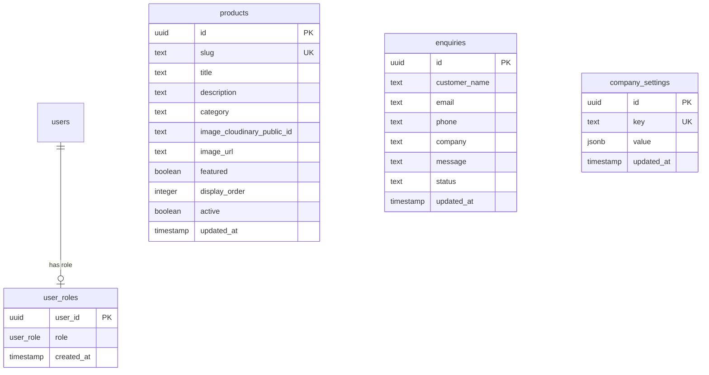
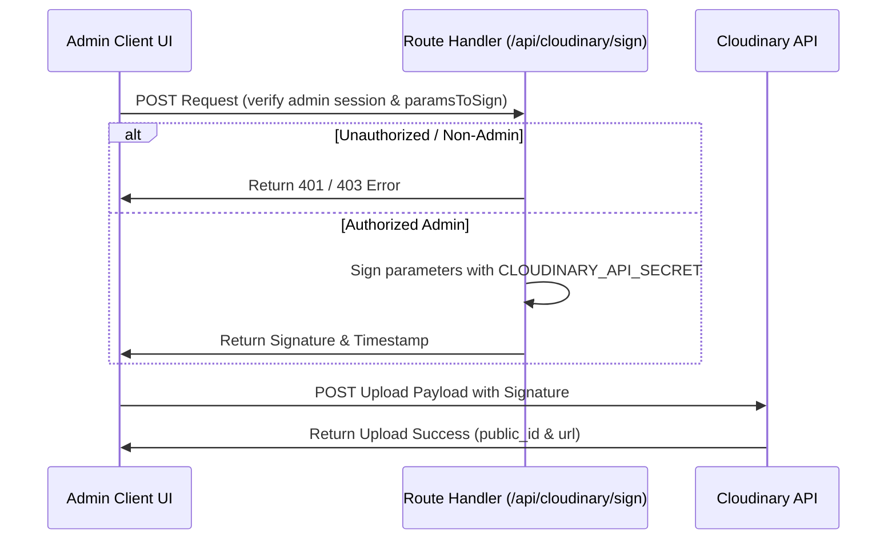

# Twinplast Polymers - Web Architecture Document

This document establishes the official technical architecture, database schemas, authorization strategies, media management conventions, and environment variables for the B2B manufacturing website for **Twinplast Polymers Private Limited**.

---

## 1. Project Directory Structure

We use a modular Next.js App Router structure under the root directory:

```text
app/
├── (public)/             # Public route group (home, products, about, contact)
│   ├── layout.tsx        # Layout with standard public header and footer
│   ├── page.tsx          # Homepage
│   ├── about/            # About Us page
│   ├── contact/          # B2B Enquiry contact form
│   └── products/         # Product catalog page and dynamic detail [slug]
│
├── admin/                # Admin Panel route group (restricted access)
│   ├── (dashboard)/      # Protected sub-routes (inheriting sidebar layout)
│   │   ├── layout.tsx    # Admin Sidebar layout with navigation links
│   │   ├── page.tsx      # Admin Dashboard overview panel
│   │   ├── enquiries/    # View B2B sheet enquiries
│   │   ├── products/     # Create & Edit polypropylene catalog items
│   │   └── settings/     # Update global plant contact metadata
│   │
│   ├── login/            # Admin console login screen (public page, no sidebar)
│   └── api/
│       └── cloudinary/
│           └── sign/     # POST: Secured endpoint for signed Cloudinary uploads
│
components/               # Reusable UI components
├── shared/               # Shared structural elements (Header, Footer, ImageContainer)
└── ui/                   # Primitive atoms (buttons, input fields)
│
lib/                      # Helper libraries
├── supabase/             # Client, Server, and Middleware initialization modules
└── cloudinary/           # Client, Server, and Transformation helpers for media
│
supabase/                 # Supabase configuration SQL migrations
└── schema.sql            # Core database definition & RLS policies
│
types/                    # TypeScript interfaces
├── database.types.ts     # Supabase-generated table schemas
└── index.ts              # Domain model exports
```

---

## 2. Platform Responsibilities

The system is split into two major backend platforms to ensure secure, performant, and scaleable operation:

| Platform | Domain | Primary Responsibilities |
| :--- | :--- | :--- |
| **Supabase** | Core Data & Auth | PostgreSQL database storage, RLS policies, user authentication/authorization, product metadata, enquires, global business settings. |
| **Cloudinary** | Rich Media & Assets | Storage of product images, website branding media, landing page assets, image transformations, responsive and optimized media delivery. |

---

## 3. Database Schema & RLS Policies

The database is built on PostgreSQL inside Supabase. It comprises four primary tables:



### Table Specifications & Data Principles
1. **`user_roles`**: Maps auth users to specific administrative roles. Note that there are no triggers granting default roles. There is **no automatic admin role assignment**; administrator privileges must be explicitly and manually assigned by inserting user UUIDs into this table via the database manager.
2. **`products`**: Contains active and draft polypropylene sheets. It relates to Cloudinary assets via two fields:
   - `image_cloudinary_public_id` (Canonical Media Reference): Stores the stable, unique identifier of the asset (e.g. `products/pp_hollow_sheet_unique_id`). This is used to dynamically construct on-demand optimized transformations.
   - `image_url` (Secondary Fallback Reference): Stores a backup or direct delivery URL (used if the asset is served from an external source or directly referenced).
3. **`enquiries`**: B2B customer submissions. Index-optimized on `(status, created_at desc)`.
4. **`company_settings`**: Flexible settings dictionary storing key-value pairs (JSONB) for site headers/footers, contact info, strengths, and social links.

### Seeding Strategies & Database Setup
- **Fresh Database Setup**: Brand-new deployments should run [schema.sql](file:///C:/Users/USER/OneDrive/Desktop/Twin%20plast/supabase/schema.sql) directly to establish the complete database layout, RLS parameters, triggers, functions, and initial seed data.
- **Existing Database Migrations**: Existing databases should run the safe migration script [001_pre_phase3_security.sql](file:///C:/Users/USER/OneDrive/Desktop/Twin%20plast/supabase/migrations/001_pre_phase3_security.sql). This migration drops the role column defaults, restricts public settings access, and inserts catalog seeds without dropping active tables.
- **Null Media Seeds**: Initial catalog seeds insert verified product descriptions, slugs, categories, and display parameters, but default the `image_cloudinary_public_id` and `image_url` columns to `NULL`.
- **Preservation of CMS Records**: Seed scripts utilize `ON CONFLICT (slug) DO NOTHING`. This ensures subsequent seed runs or database updates never overwrite customization edits or images added by admins.
- **Public-Safe Settings Key Whitelist**: To prevent administrators from accidentally storing secret API tokens, operational codes, or keys in `company_settings` and leaking them to the public, the public SELECT RLS policy strictly restricts queries to an explicit whitelist of safe keys: `company_name`, `public_phone`, `public_email`, `public_address`, `website_metadata`, `social_links`, and `business_info`. Any other keys are invisible to anonymous requests.

### Secure Row Level Security (RLS) Rules
We implement custom functions to enforce clean authorization:
- **`public.is_admin(user_id)`**: Verifies if the user UUID matches an `admin` role in `user_roles`. Set to `SECURITY DEFINER` and restricted with `set search_path = public` to prevent RLS recursion and privilege escalations.
- **Policies**:
  - **Products**: Select is permitted for the public if `active = true`. Admins can read, insert, update, or delete any record.
  - **Enquiries**: Insert is permitted for public anonymous requests (contact form submission). Reading and updating are strictly restricted to admins.
  - **Company Settings**: Read-only access is open to the public. Management (update/insert) is restricted to admins.

---

## 4. Authentication & Authorization Flow

Authentication is managed via Supabase Auth. Authorization checks are executed in two layers:
1. **Next.js Network-Boundary Proxy Layer (`proxy.ts`)**: Intercepts requests pointing to `/admin` (except `/admin/login`). It reads the cookie session, refreshes the token, and queries the database role. If the user is missing the `admin` role, it immediately halts rendering and redirects them to the login screen.
2. **Postgres RLS Layer**: If a client bypasses application code, the database blocks any read/write operation unless `is_admin(auth.uid())` resolves to true.

---

## 5. Cloudinary Media Strategy

> [!IMPORTANT]
> Cloudinary is the media storage, transformation, and delivery platform. Supabase Storage is not used for website media.

### Upload Security
To prevent visual contamination and storage abuse, Twinplast does **NOT** use unrestricted unsigned upload flows. 
- **Signed Upload Workflow**: Upload widgets obtain permission dynamically. The client requests a secure signed signature from `/api/cloudinary/sign` before uploading.
- **Server Verification**: The signature endpoint verifies the Supabase session cookies and confirms that the caller exists in the `user_roles` database with the `admin` role. If validated, the endpoint signs the upload payload using the server-only `CLOUDINARY_API_SECRET` and returns it.



### Image Delivery & Transformations
Images are rendered dynamically to minimize data transfer and ensure responsive sizing:
- **Optimization Utilities**: A helper function `getOptimizedImageUrl(publicId, options)` generates optimized Cloudinary URLs on demand.
- **Auto Format and Quality**: All generated URLs include `f_auto` (serves modern image formats like AVIF or WebP based on browser support) and `q_auto` (dynamic quality compression).
- **Enforcing Visual Integrity**: The codebase uses the custom `<ImageContainer />` component. This component locks the media elements into CSS-enforced container boxes (e.g. `aspect-video` or `aspect-square`) with standard Tailwind `object-cover` styling.

---

## 6. Environment Configuration

The application requires the following environment variables:

```bash
# --- SUPABASE CONFIG ---
# Public (Browser-safe)
NEXT_PUBLIC_SUPABASE_URL=https://your-project-id.supabase.co
NEXT_PUBLIC_SUPABASE_ANON_KEY=your-supabase-anon-key

# --- CLOUDINARY CONFIG ---
# Public (Browser-safe)
NEXT_PUBLIC_CLOUDINARY_CLOUD_NAME=your-cloud-name
NEXT_PUBLIC_CLOUDINARY_API_KEY=your-api-key

# Server-Side Only (NEVER expose to client components or commit to Git)
CLOUDINARY_API_SECRET=your-cloudinary-api-secret
```
Under no circumstances should `CLOUDINARY_API_SECRET` be defined in front-end client components.
